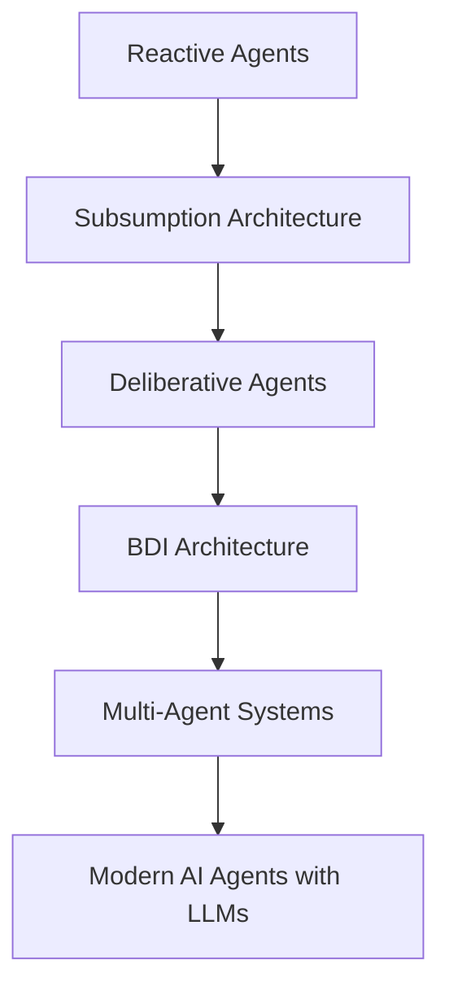

# Evolution of Agent Architectures

The development of intelligent agents has progressed through several architectural approaches within artificial intelligence research. These architectures differ in how agents perceive their environment, reason about problems, and decide on actions.

## Agent Architecture Evolution

## Reactive Agents

Reactive agents respond directly to environmental stimuli without building internal world models. They rely on simple condition–action rules.

Example:

`if obstacle detected → turn`

Reactive agents are typically:

- fast
- simple
- robust

However, they are limited in their ability to perform complex reasoning or planning.

## Subsumption Architecture

Subsumption architecture is a reactive architecture introduced by Rodney Brooks. It organises behaviour into layers, where higher layers can override lower ones.

Example behavioural layers:

- obstacle avoidance
- wandering
- exploration

This architecture demonstrated that complex behaviour can emerge from simple interacting behaviours.

## Deliberative Agents

Deliberative agents maintain an internal representation of the world and use reasoning or planning to determine actions.

Typical reasoning cycle:

1. perceive the environment
2. update internal world model
3. generate a plan
4. execute actions

These architectures were common in early symbolic AI systems.

## BDI Architecture

The Belief–Desire–Intention (BDI) model is a hybrid architecture combining reactive behaviour with goal-directed reasoning.

Components include:

- **Beliefs** – information the agent has about the world
- **Desires** – goals the agent aims to achieve
- **Intentions** – the plans the agent commits to executing

BDI architectures are widely used in multi-agent system research.

## Multi-Agent Systems

Multi-agent systems consist of multiple interacting agents that cooperate or compete to solve complex problems.

Examples include:

- distributed robotics
- supply chain coordination
- intelligent monitoring systems

## Modern AI Agents

Recent advances in artificial intelligence have introduced agents powered by large language models (LLMs). These agents can reason, analyse information and interact with tools.

Modern systems may combine:

- multi-agent architectures
- machine learning models
- external tools
- memory and retrieval systems
